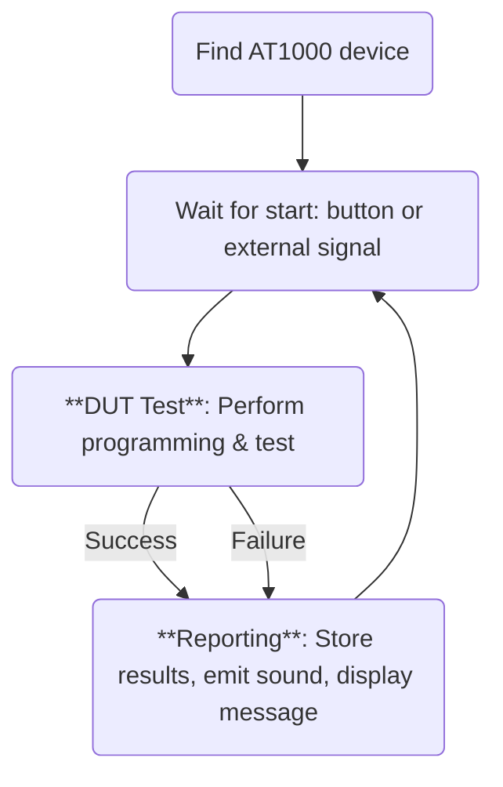

# Getting Started with AT1000


## Overview
It's important to note that AT1000 is designed to operate in two different modes:

* Stand-Alone mode : the AT1000 device can perform the test without being connected to the computer (this is also possible for a group of AT1000 devices that are daisy-chained). In this scenario, the JavaScript or Python code runs from the internal memory of the AT1000.
* Remote mode : the AT1000 device, or the group of daisy-chained devices, are remotely controlled by your computer to which it's connected by USB or ethernet. In this scenario, the JavaScript or Python code runs on your computer.

Both configuration achieve same results, so which one to employ totally depends on your application and your requirements.

:::tip It's all TCP/IP under the hood
Under the hood, all interactions with AT1000 hardware happens over TCP/IP transactions. In case of Stand-alone mode, commands are sent to `localhost`, in case of remote operation, TCP/IP commands are sent to the right IP address. 

The JavaScript / Python modules takes care of these details, making the code totally portable between **stand-alone** and **remote** mode, without any modification needed.
:::

## Installing AT1000 project

It's possible to create an AT1000 project either automatically, using the AT1000 config tool, or manually. The AT1000 config tool makes it easier to get started, and offer ready to use templates. Additionally, using the AT1000 config tool is mandatory for creating stand-alone projects. 

### Automatic install

Alternatively, you can use the AT1000 config tool to generate a new JavaScript (nodeJS) or Python project. This is the preferred method.

TODO: update this part with proper procedure from AT1000 configuration App.


### Manual install
If you're using the device in remote mode, you can create an AT1000 project on your computer as you would create any Python or JavaScript project.


import Tabs from '@theme/Tabs';
import TabItem from '@theme/TabItem';

<Tabs>
<TabItem value="js" label="NodeJS">

```sh
npm install at1000
```

</TabItem>
<TabItem value="py" label="Python">

```sh
pip install at1000
```

</TabItem>
</Tabs>


## A simple AT1000 sequence

Before going further into the documentation of the API, let's look at the flow chart of a simple - a very simple - test sequence and understand the main steps. Please note there are many ways a test sequence can be implemented and adapted to your constraints, this is just a general example.

TODO: add equivalent code as an example




## Setting up daisy-chained AT1000 devices

:::note Note
If you do not intend to connect several AT1000 devices together in a daisy-chained fashion, you can skip this section.
:::

TODO: Explain how to configure the master and slaves in a daisy chained config.


## Discovering AT1000 Devices

Before a test sequence can be launched (controlling outputs and measuring inputs), and device needs to be **opened**.

The following code will list all devices found on the network and print their serial numbers in the console:

```javascript
const at1000 = require("at1000");
let devices = at1000.find_devices(5); // Find devices with a 5s timeout
// Loop through devices and print their serial numbers
devices.forEach((device, index) => {
  console.log(`Device ${index + 1}: Serial Number - ${device.serialnumber}`);
});
```

The following code will **open** the first device in the list:

```javascript
const at1000 = require("at1000-node");
let devices = at1000.find_devices(5); // Find devices with a 5s timeout
let tester = devices[0]; // target the first detected device
```


```python
import at1000
devices = at1000.find_devices(5)  # Find devices with a 5s timeout
tester = devices[0]  # Open the first detected device
```

:::tip Important node about daisy-chained devices

When multiple devices are daisy-chained, All communications go throught the **master** device. In other words, all communication to slave devices are relayed through that single master device. The device rank (which is 0 for the master) is used in various places in this API to select a specific device in the chain.

:::

:::note Note
The code examples in the following sections of this documentation assume that `tester` variable represents an AT1000 device. The code to find an AT1000 device and create `tester` variable is not included in most code snippets for simplicity.
:::

:::caution Using only one AT1000?

If you're using only 1 AT1000 tester and feel not concerned by the daisy-chained related syntax, you can simply ignore the device rank or set it to 0 in the various function calls that require it.

:::
