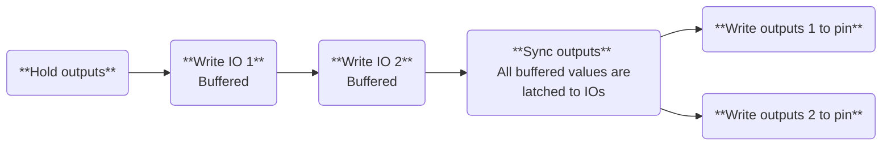

# Output synchronization

In many situation, it's useful to synchronize the instant at which several outputs change. In AT1000 context, this is done with the **Output hold mechanism**. This mechanism allows for the writes commands to store the data in a buffer and only latch it to the physical pins of the AT1000 on a given synchronization edge. This is described with the example below, where outputs 1 and 2 need to be applied simultaneously (not sequentially, i.e. not one after the other):



Thanks to the `hold` and `sync` feature, the physical outputs *do not* update sequentially, as the commands are received by the AT1000 device, but on the opposite, the outputs are all updated after the `sync` command.

This output synchronization mechanism can be used to synchronize any variety of outputs:
* Digital outputs
* Analog outputs
* Outputs spanning across multiple daisy-chained devices

:::note Note
For the output synchronization to work properly across multiple daisy-chained AT1000 devices, the AT1000 devices must be connected together with SMA cables using the SYNC-IN and SYNC-OUT SMA connector. Please refer to the product datasheet for more details on this connection.
:::

The following code snippet shows a clear example of using the output synchronization:


import Tabs from '@theme/Tabs';
import TabItem from '@theme/TabItem';

<Tabs>
<TabItem value="js" label="NodeJS">

```javascript
const at1000 = require("at1000-node");
let devices = at1000.find_devices(5); // Find devices with a 5s timeout
let tester = devices[0]; // Open the first detected device

var test_pin5 = tester.digital_io(5);
var test_pin6 = tester.analog_io(6);
test_pin5.config_output(3.3, 0, false); 
test_pin6.config_output(2.5); 

//At this point in time, pin 5 reads 0V (digital 0)
//and pin 6 reads 2.5 volts (default value configured)

tester.hold_outputs();

test_pin5.write(1); 
test_pin6.write(9.5);

//At this point in time, pins 5 and 6 remain unchanged

tester.sync_outputs();

//At this point in time, pin 5 reads 3.3V (digital 1)
//and pin 6 reads 9.5 volts
```

</TabItem>
<TabItem value="py" label="Python">

```python
import at1000

# Find devices with a 5s timeout
devices = at1000.find_devices(5)
tester = devices[0]  # Open the first detected device

# Initialize GPIO 5 as a digital output and GPIO 6 as an analog output
test_pin5 = tester.digital_io(5)
test_pin6 = tester.analog_io(6)

# Configure GPIO 5 as a digital output with VOH = 3.3V, VOL = 0V, Default = 0V (LOW)
test_pin5.config_output(3.3, 0, false)

# Configure GPIO 6 as an analog output with a default value of 2.5V
test_pin6.config_output(2.5)

# At this point, pin 5 reads 0V (digital 0)
# and pin 6 reads 2.5V (default configured value)

tester.hold_outputs()  # Hold all outputs (changes won't take effect immediately)

# Set new output values (but they remain unchanged due to hold_outputs())
test_pin5.write(1)  # Request pin 5 to go HIGH
test_pin6.write(9.5)  # Request pin 6 to output 9.5V

# At this point, pins 5 and 6 remain unchanged

tester.sync_outputs()  # Synchronize all held outputs

# Now, pin 5 reads 3.3V (digital 1)
# and pin 6 reads 9.5V
```

</TabItem>
</Tabs>

The timing diagram below illustrates the effect of the `hold` and `sync` mechanism in the example snippet above:


